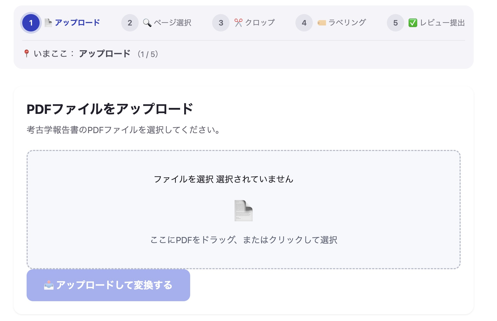
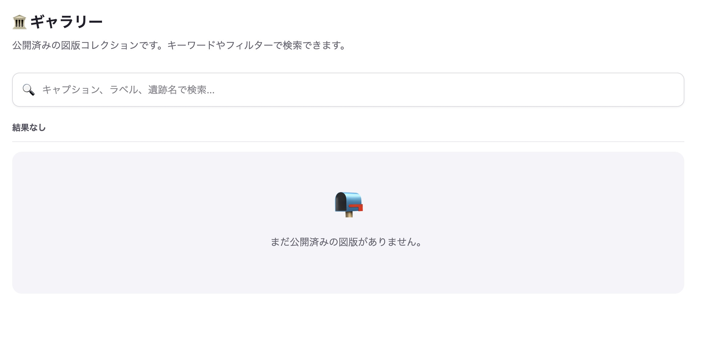

# AlchemIIIF

[](https://github.com/SilentMalachite/AlchemIIIF/actions/workflows/ci.yml)
[](https://elixir-lang.org/)
[](https://www.phoenixframework.org/)
[](https://www.postgresql.org/)
[](https://iiif.io/)
[](https://github.com/SilentMalachite/AlchemIIIF/blob/main/LICENSE)

**A web application that converts archaeological PDF reports into IIIF v3 digital archives.**

PDFの考古学報告書をIIIF v3対応のデジタルアーカイブに変換するWebアプリケーション。

---

## Background

Archaeological excavation reports in Japan are produced by professionals whose core work is fieldwork and analysis — not digital archiving. At the same time, people with disabilities working in supported employment settings often lack access to tasks that feel genuinely meaningful.

AlchemIIIF was built to bridge these two realities: giving archaeological institutions a practical path to IIIF-compliant digital archives, while providing supported employment workers with structured, meaningful tasks they can take pride in.

---

考古学の調査担当者にとって、デジタルアーカイブの作成は本来の仕事ではありません。一方、就労継続支援の現場では、「意味のある仕事をしている」という実感を持てる作業が少ないことが課題です。

AlchemIIIF はこの二つの現実をつなぐために作られました。文化財機関が国際標準（IIIF）に準拠したデジタルアーカイブを自前で作成・配信できる環境を提供しながら、その作業プロセスを障がいのある方々が担える形に設計しています。

---

## What it does

- Upload a PDF report → pages are automatically converted to high-resolution PNG
- Select figures, crop them with a polygon tool, and add metadata
- A review workflow ensures quality before publication
- Approved images are published as IIIF v3 Manifests, viewable in any IIIF-compatible viewer




---

## Who is this for

- **Archaeological institutions and local governments** that want to publish excavation reports as interoperable digital archives, without vendor dependency
- **Supported employment facilities** (*就労継続支援*) looking for structured, meaningful work for people with disabilities
- **IIIF developers and cultural heritage technologists** interested in a real-world Elixir/Phoenix implementation

---

## Quick Start

```bash
# 1. Clone
git clone https://github.com/SilentMalachite/AlchemIIIF.git
cd AlchemIIIF

# 2. Install dependencies and set up database
mix setup

# 3. Start the server
mix phx.server
```

Open [http://localhost:4000/lab](http://localhost:4000/lab) in your browser.

**Default accounts** (created by `mix ecto.setup`):

| Role  | Email | Password |
|-------|-------|----------|
| Admin | `admin@example.com` | `Password1234!` |
| User  | `user@example.com`  | `Password1234!` |

For Docker and production deployment, see [DEPLOYMENT.md](DEPLOYMENT.md).

---

## Documentation

| Document | Description |
|----------|-------------|
| [ARCHITECTURE.md](ARCHITECTURE.md) | System design and technical decisions |
| [IIIF_SPEC.md](IIIF_SPEC.md) | IIIF v3 implementation details |
| [DEPLOYMENT.md](DEPLOYMENT.md) | Docker and production deployment |
| [CONTRIBUTING.md](CONTRIBUTING.md) | How to contribute |
| [CHANGELOG.md](CHANGELOG.md) | Release history |

---

## Tech Stack

| | |
|---|---|
| Language / Framework | Elixir 1.15+ / Phoenix 1.8+ (LiveView) |
| Database | PostgreSQL 15+ |
| Image processing | [vix](https://github.com/akash-akya/vix) (libvips) |
| PDF conversion | poppler-utils (pdftoppm) |

---

## License

Apache License 2.0 — see [LICENSE](LICENSE) for details.

---

## Acknowledgements

- [IIIF (International Image Interoperability Framework)](https://iiif.io/)
- [Phoenix Framework](https://www.phoenixframework.org/)
- [vix (libvips Elixir wrapper)](https://github.com/akash-akya/vix)
